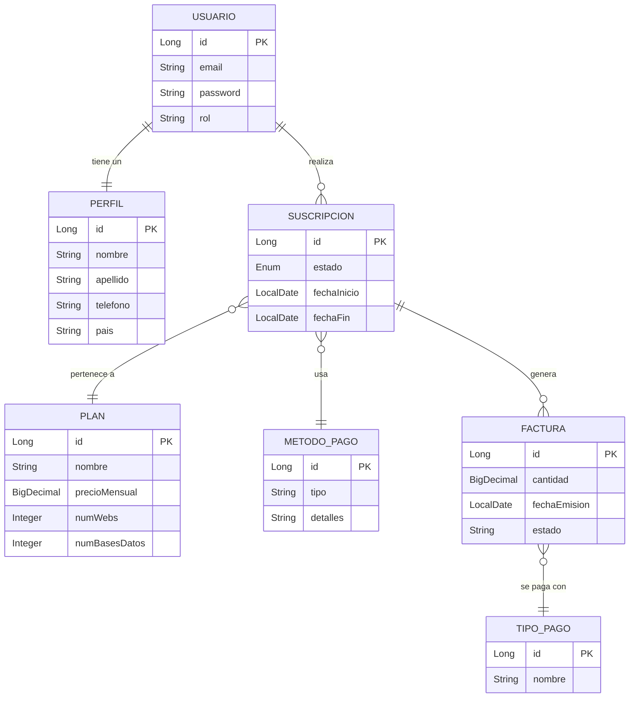

# Diagrama Entidad-Relación (E-R) Normalizado

A continuación se muestra el esquema de la base de datos del sistema, representando las entidades principales y sus relaciones.

## Normalización

El esquema cumple con la Tercera Forma Normal (3NF):
1.  **1NF**: Todos los atributos son atómicos.
2.  **2NF**: No hay dependencias parciales (todas las tablas tienen PK única).
3.  **3NF**: No hay dependencias transitivas (ej. los detalles del usuario están en `Perfil` y no duplicados en `Suscripcion`).

## Auditoría (Envers)

Las entidades `Usuario`, `Plan`, y `Suscripcion` cuentan con tablas de auditoría (`_AUD`) generadas automáticamente por Hibernate Envers para mantener un historial de cambios.
